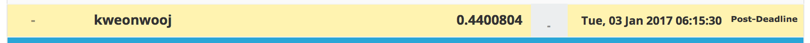

# Kaggle / Avazu Click-Through Rate Prediction

<div align="center">
  <br><br>
</div>

## Abstract
[Kaggle Click-Through Rate Prediction](https://www.kaggle.com/c/avazu-ctr-prediction)

- Host : [**Kaggle**](http://www.outbrain.com/)
- Prize : $ 15,000
- Problem : Binary Classification for Recommendation
- Evaluation : [Logarithmic Loss](https://www.kaggle.com/wiki/LogarithmicLoss)
- Period : Nov 18 2014 ~ Feb 09 2015 (83 days)

Predict whether a mobile ad will be clicked

In online advertising, click-through rate (CTR) is a very important metric for evaluating ad performance. As a result, click prediction systems are essential and widely used for sponsored search and real-time bidding.

For this competition, we have provided 11 days worth of Avazu data to build and test prediction models. Can you find a strategy that beats standard classification algorithms? The winning models from this competition will be released under an open-source license.


## Result
| Submission | CV logloss | Public LB | Rank | Private LB | Rank |
|:----------:|:----------:|:---------:|:----:|:----------:|:----:|
| bare_minimum | 0.4175405 | | | 0.4400804 | **1353** |
|

## How to Run

**[Data]** 

Place data in ```root_input``` directory. You can download data from [here](https://www.kaggle.com/c/the-nature-conservancy-fisheries-monitoring/data).

**[Code]**

Above results can be replicated by runinng

```
python code/main.py
```
for each of the directories.

Make sure you are on Python 3.5.2 with library versions same as specified in requirements.txt

**[Submit]**

Submit the resulting csv file [here](https://www.kaggle.com/c/digit-recognizer/submissions/attach) and verify the score.

## Expected Result

for bare minimum
<div align="center">
  <br><br>
</div>

## Winnig Solutions
